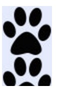
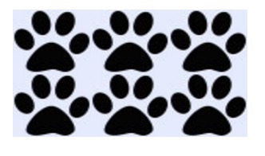
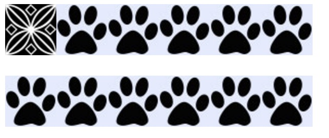

#background-repeat

*Defines how or if the image in the `background-image` property should be repeated*

The `background-repeat` propery defines whether the image set in the `background-image` property of an element should be repeated. If the `background-image` is to be repeated, the `background-repeat` value will define whether the image is to be repeated along the x, y, or both x and y axis. By default, background-repeat is set to repeat on both vertically and horizontally (both the x and y axis).

## Syntax

The syntax for the `background-repeat` property:

```
       background-repeat: repeat | repeat-x | repeat-y | no-repeat | initial | inherit;
```

### Values

The `background-repeat` property defaults to repeat, but allows for the following values:

#### repeat

`repeat` will cause the background image to be repeated both vertically and horizontally. This is the default behavior.  


#### no-repeat

`no-repeat` will prevent the background image from being repeated.  


#### repeat-x

`repeat-x` will cause the background image to only be repeated along the x-axis.  


#### repeat-y

`repeat-y` will cause the background image to only be repeated along the y-axis.  


#### initial

`initial` will set the property to it's default value, in this case back to `repeat`.  


#### inherit

`inherit` will set the property to the value set on its parent element.  


#### round

`round` will cause the background image to stretch to fit the width of the element unless antother image will fit.  


#### space

`space` will cause the image to repeat as much as possible with out clipping, unless there is only room for one image to display inside the elements width. Images are added with whitespace evenly divided between the images until a new instance of the background image can be inserted. This also causes the `background-position` property to be ignored unless only one image is being displayed.  


## Example 1

The `background-repeat` property is only used in conjunction with the `background-image` property. Here the background will only repeat along the x-axis.

```
       body{
           background-image: url("texture.jpg");
           background: repeat-x;
       }
```


## Example 2

The `background-repeat` property can also be used in the shorthand property for `background`. Here the `background-repeat` property is being set to `no-repeat` in the `background` shorthand property.

```
       body {
           background: url("texture.jpg") no-repeat;
       }
```


## Example 3 - Complex

In most modern browsers, the `background-image` property can contain multiple background images. Here the `background-repeat` property is set to `no-repeat` for the first image and `repeat-x` for the second image.

```
        body {
            background-image: url("texture.jpg"), url("bg-repeat.jpg");
            background-repeat: no-repeat, repeat-x;
```


## Special Notes

Add information that you found that seemed lesser known. Common bugs, obscure bugs, important distinctions, all belong in this section.

