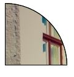
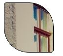
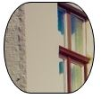

#border-top-right-radius
*Defines the round border at the top right most side*

## Syntax
`
border-top-right-radius: length|% [length|%]|initial|inherit;
`
This is not supported by all browsers. It's always a good practise to prefix -webkit and -moz(for mozilla) for browser support i.e.,

**Eg:**
`
div {
    border: 2px solid;
    border-top-right-radius: 2em;
}
`
can be written as:

`
div {
    border: 2px solid;
    border-top-right-radius: 2em;
    -web-border-top-right-radius: 2em;
    -moz-border-top-right-radius: 2em;
}
`
## Special Notes

** Different types of border edges can be created by modifying the length and width of the divs.**
* Semi-circle
```
<div style="width:100px;height:100px"></div>

div {
  border-top-right-radius: 100%;
  background-image: url('http://666a658c624a3c03a6b2-25cda059d975d2f318c03e90bcf17c40.r92.cf1.rackcdn.com/unsplash_527bf56961712_1.JPG');
  border: 1px solid black;
}
```


* three value radius that shows symetrical shapes:
```
<div style="width:100px;height:100px"></div>

div {
  border-radius: 5px 50px 5px;
  background-image: url('http://666a658c624a3c03a6b2-25cda059d975d2f318c03e90bcf17c40.r92.cf1.rackcdn.com/unsplash_527bf56961712_1.JPG');
  border: 1px solid black;
}
```


* Elliptical
```
<div style="width:100px;height:100px"></div>

div {
  border-radius: 30px/50px;  /* horizontal radius / vertical radius */
  background-image: url('http://666a658c624a3c03a6b2-25cda059d975d2f318c03e90bcf17c40.r92.cf1.rackcdn.com/unsplash_527bf56961712_1.JPG');
  border: 1px solid black;
}

```
